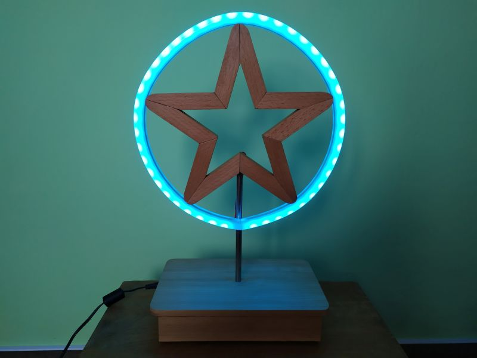

# Neopixel LED Star

Hvězda se 44 neopixel LEDkami zobrazuje 21 efektů. Efekty se automaticky přepínají po 2 minutách, ale je možné je přepínat i ručně tlačítkem. Tlačitkem lze také volit barvu LEDek a jejich jas.

##### Funkce tlačítka:
1 stisk přepíná efekty (celkem 21 efektů + jedna pozice pro automatické přepínání)  
2 rychlé stisky mění barvu (pouze při efektu, který používá jednu barvu)  
1 dlouhý stisk mění jas LEDek (celkem 5 nastavení jasu)  

## Seznam součástek

|    Ref   | Qnty |          Value         |     Cmp name     |
|:--------:|:----:|:----------------------:|:----------------:|
| C1,      | 1    | 1000uF/10V             | C_Polarized      |
| C2, C3,  | 2    | 10uF                   | C                |
| C4, C6,  | 2    | 100nF                  | C                |
| C5,      | 1    | 4u7                    | C                |
| J1,      | 1    | Power Supply Jack      | Conn_01x02       |
| J2,      | 1    | Neopixel solder points | Conn_01x03       |
| J3,      | 1    | Programming Connector  | Conn_01x04       |
| R1,      | 1    | 470R                   | R                |
| SW1,     | 1    | Switch                 | SW_Push          |
| U1,      | 1    | HT7533                 | HT75xx-1-SOT89   |
| U2,      | 1    | STM32G031J6M6          | STM32G031J6M6    |
| U3,      | 1    | 74AHCT1G125QW5-7       | 74AHCT1G125QW5-7 |
